# Tourism Guide Management System Admin Panel Frontend
## Overview
This project is Admin Panel for Tourism Guide Management System using React and Bootstrap.

## Deployment
The project is deployed on Azure Static Apps. You can get the live application [here](https://orange-flower-0f3ed7510.5.azurestaticapps.net/).
You can login with email: buraksazli@gmail.com and password: 123Burak@

## Installation

1. Clone project

```bash
git clone https://github.com/buraksazli/TourismGuideManSys-Frontend.git
```

2. Go into folder

```bash
cd TourismGuideManSys-Frontend
```

3. Install all dependencies

```bash
npm install
```
## Screens
### Login
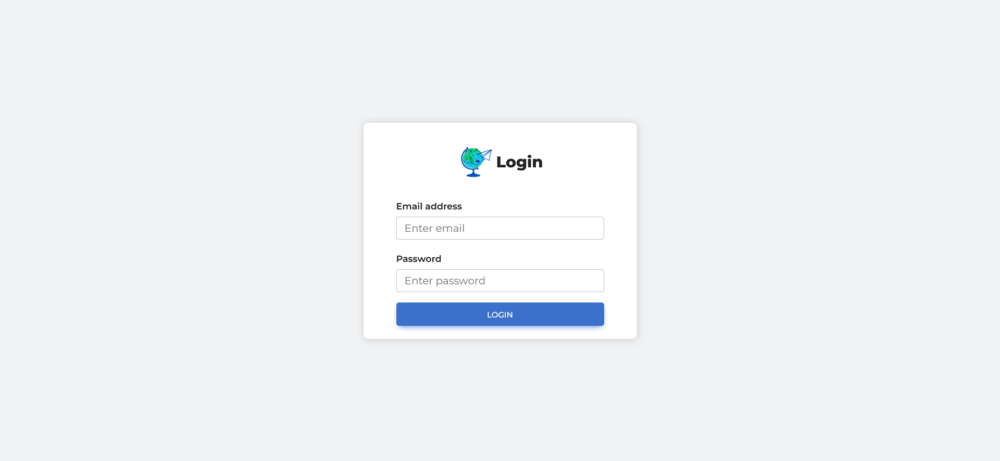

### Home
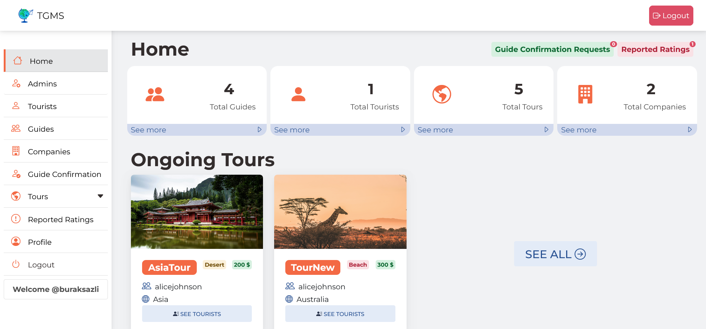

### Admins
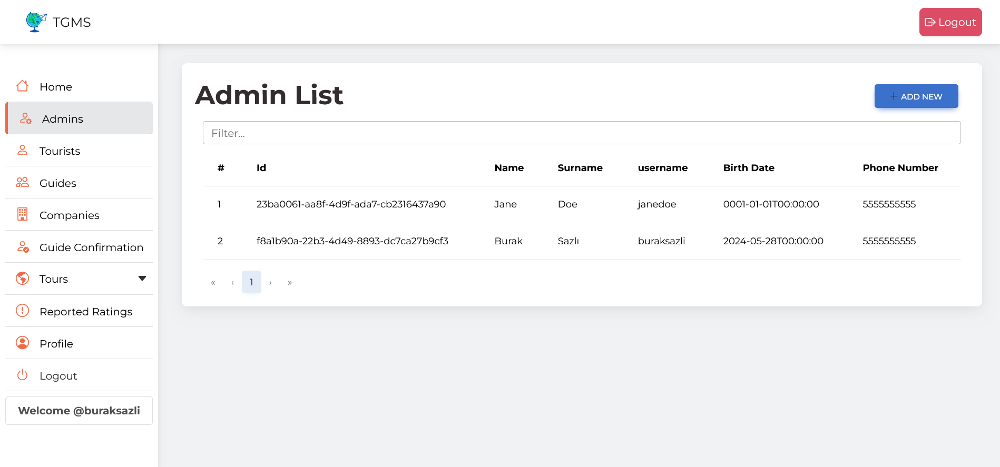

### Tourists
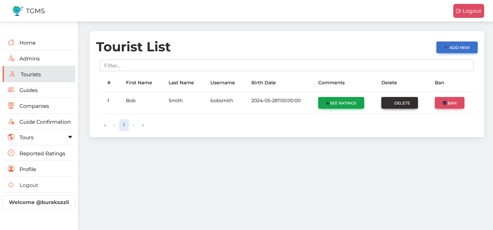

### Guides
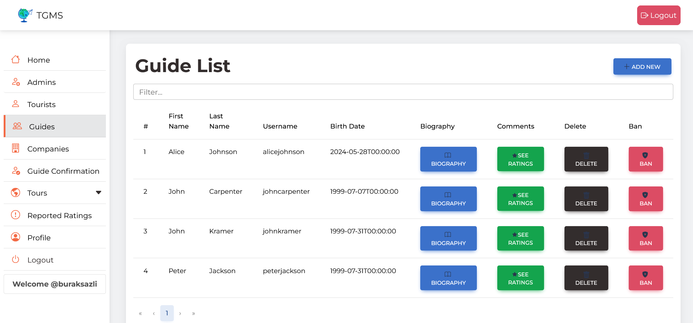

### Companies
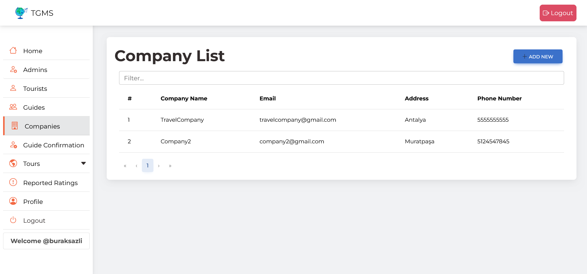

### Guide Confirmation
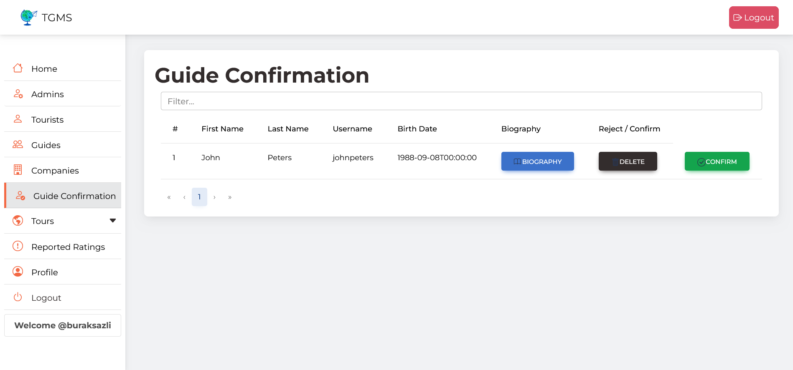

### Ongoing Tours
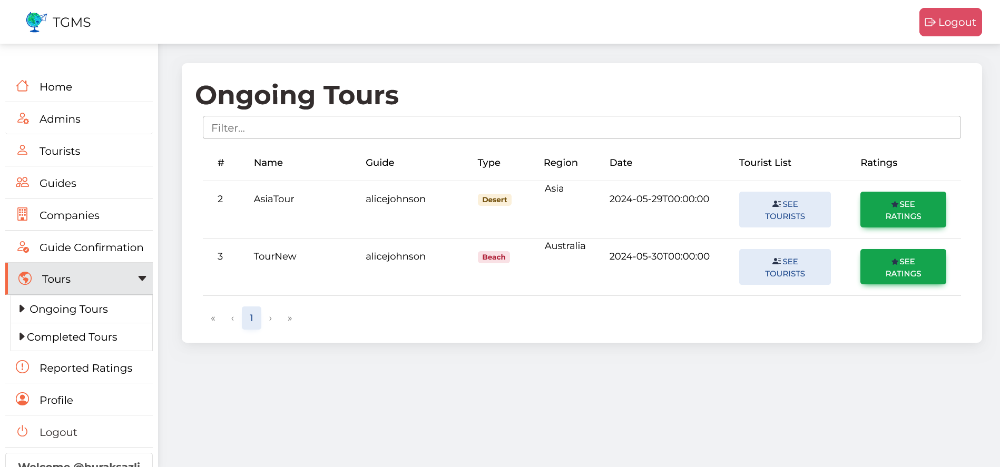

### Completed Tours
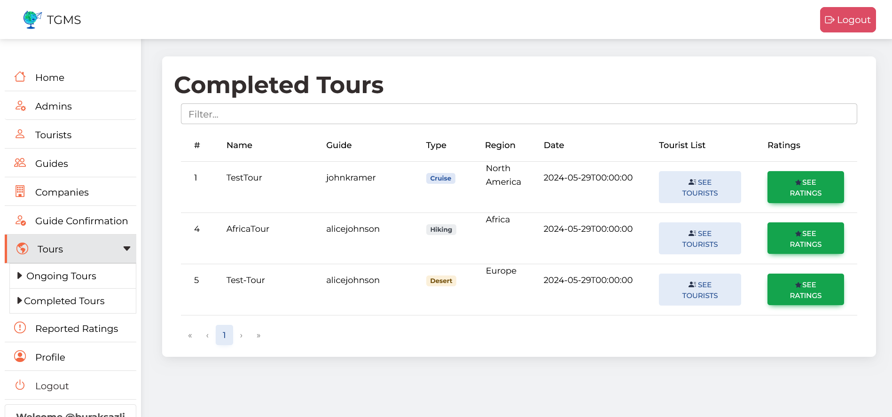

### Ratings
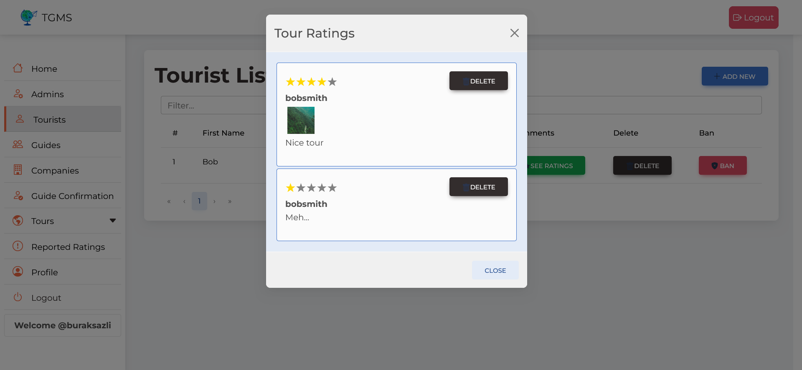

### Reported Ratings
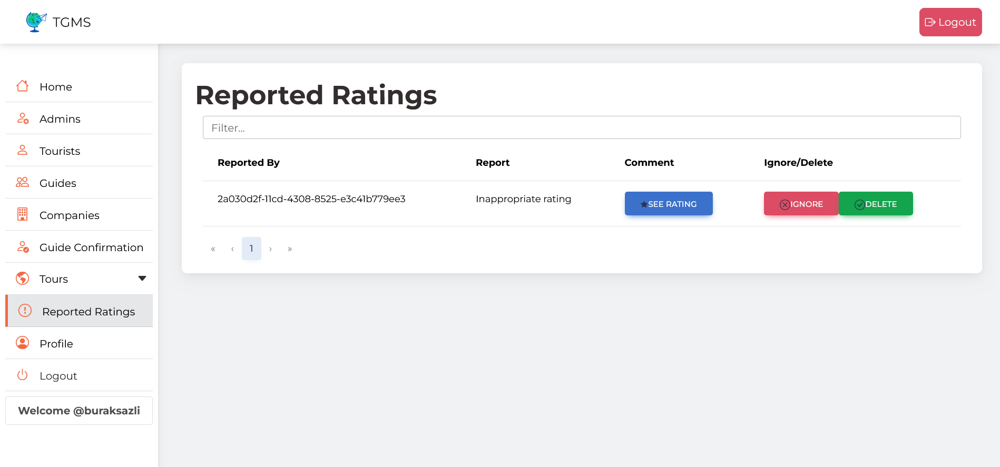

### Profile
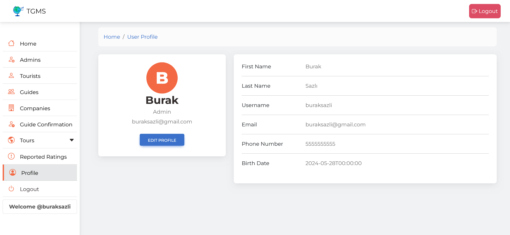

### Edit profile
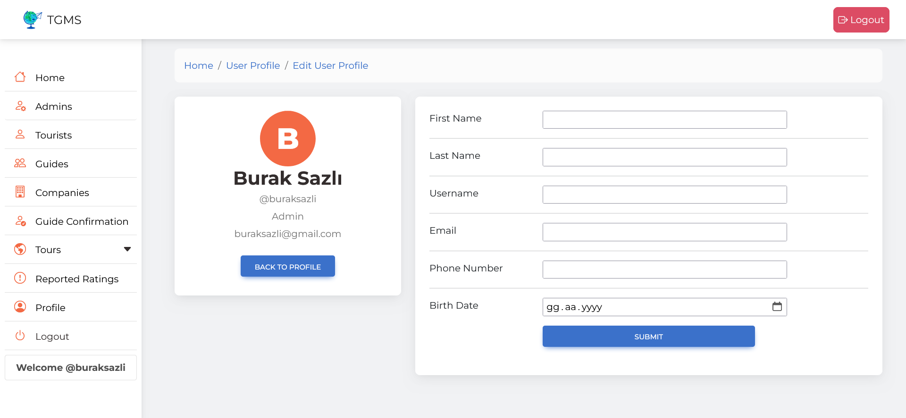
